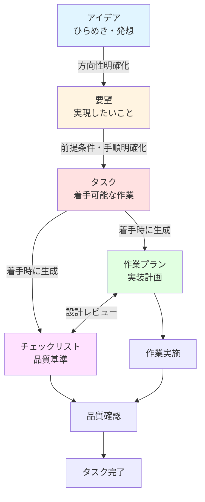
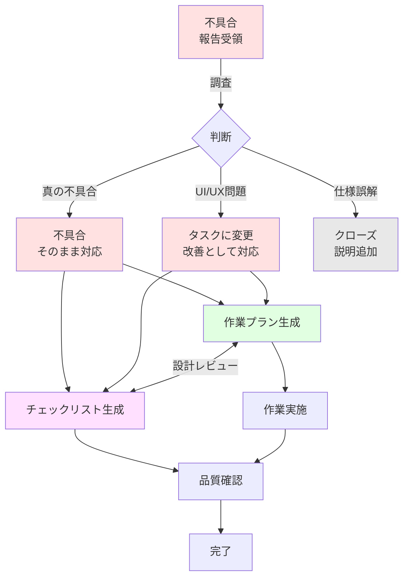
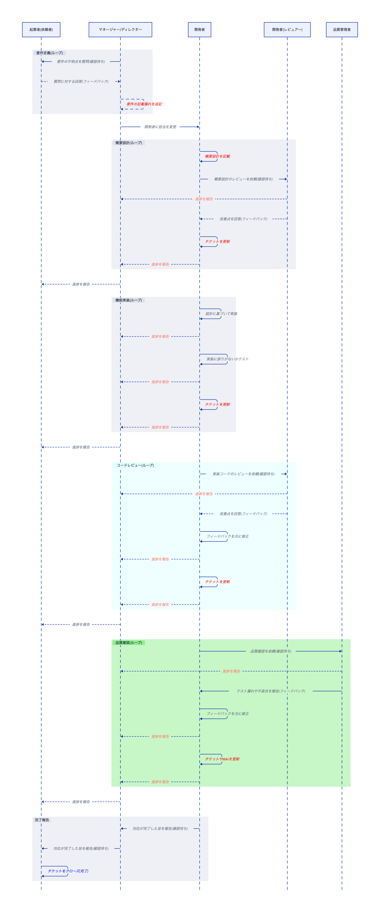

チケット管理の流れ
=========================

概要
-------------------------

本資料では、[[チケット管理の仕組み]]で示した全体像を前提に、アイデアから実装完了までの流れを図表と実例で補足します。
特に、実装前に要件・前提条件・確認観点を整理し、手戻りを防ぐシフトレフトの考え方に重点を置きます。
成果物ごとの役割や判断基準の詳細は、[[成果物ごとの役割]]と[[判断に迷ったときのFAQと実例|FAQと実例]]を参照してください。

全体の流れ
-------------------------

### 新機能開発の流れ



### 不具合対応の流れ



### 要件定義から完了報告までの流れ


<!-- source: issue_sequence.d2 -->

設計段階でのレビュー
-------------------------

この流れで特に重要なのは、いきなりコードを書き始めず、実装前に要件・前提条件・確認観点を整理してクロスチェックすることです。
新機能/不具合の基本線そのものは[[チケット管理の仕組み]]で説明しているため、このページでは「なぜ実装前レビューが必要か」を明示します。

### シフトレフトとしての位置づけ

チケットに内容を残し、作業プランとチェックリストへ落とし込むことで、頭の中にしかない情報を見える形にできます。
これにより、担当者間のレビューや引き継ぎでも、実装前の段階で抜け漏れを確認できます。
この仕組みは人だけでも運用でき、必要に応じてAIや補助ツールを使うと整理をさらに効率化できます。

### 実装前に確認すること

- 何を実現したいかが明確か
- 前提条件や制約が整理されているか
- 作業プランで要件を満たせるか
- チェックリストに確認観点の抜け漏れがないか

この確認を先に行うことで、実装後に「求めていたものと違う」と気づく無駄な手戻りを減らせます。
詳細なレビュー観点は[[成果物ごとの役割]]を参照してください。

なぜ実装前レビューが必要なのか
-------------------------

### よくある失敗例

#### 失敗1: 思いつきが消える

- 会議中のアイデアを記録しなかったため、あとから内容を思い出せなくなる

#### 失敗2: 勘違いで手戻り

- 実装完了後に「求めていたのはこれじゃない」と分かり、要件理解不足による手戻りが発生する

#### 失敗3: 完了の基準が曖昧

- 「これで完成です」と報告したあとに確認項目が追加され、完了条件の未合意が表面化する

### この仕組みで防げること

- 思いつきの消失を防ぎ、あとから見返せる形で残せる
- 荒い情報を段階的に具体化し、認識のズレを早めに見つけられる
- 実装前に計画と要件を突き合わせ、無駄な手戻りを減らせる

実例で理解する
-------------------------

ユーザー登録機能を追加する場合を例に、流れを段階ごとに整理します。

```text
アイデア → 要望 → タスク → チェックリスト/作業プラン → 設計レビュー → 実装 → 品質確認 → 完了
```

### 例: ユーザー登録機能を追加する場合

#### 1. アイデア

- タイトル: ユーザー登録機能があったら便利かも
- 状況
    - まだ具体的な実装方法は決まっていない
    - 技術的に可能かも未検証
    - まずは記録しておく段階

#### 2. 要望

- タイトル: 会員制サービスにしたいので、ユーザー登録機能が必要
- 状況
    - 実現したい内容が明確になった
    - 方向性や目標が定まった
    - 具体的な実装方法はまだ決まっていない

#### 3. タスク

- タイトル: ユーザー登録機能の実装
- 内容
    - メールアドレスとパスワードで登録
    - メール認証必須
    - 画面設計: 完了
    - DB設計: 未定
    - 期限: 2週間後

#### 4. チェックリスト生成

- 入力検証
    - メールアドレス形式チェック
    - パスワード強度チェック
- セキュリティ
    - パスワードハッシュ化
    - SQLインジェクション対策
- エラーハンドリング
    - 重複メールアドレス
    - ネットワークエラー対応

#### 5. 作業プラン生成

- DB設計
    - `users`テーブル設計
    - `email_verifications`テーブル設計
- バックエンド実装
    - 登録API作成
    - メール送信機能
    - 認証トークン生成
- フロントエンド実装
    - 登録フォーム
    - 認証画面

#### 6. 設計レビュー

- 作業プランとチェックリストを突き合わせる
- たとえば、ネットワークエラー対応の抜け漏れを実装前に発見する

#### 7. 実装

- 作業プランに沿って実装する

#### 8. 品質確認

- チェックリストの各項目を確認する

#### 9. タスク完了

- すべての確認項目を満たしたら完了とする
