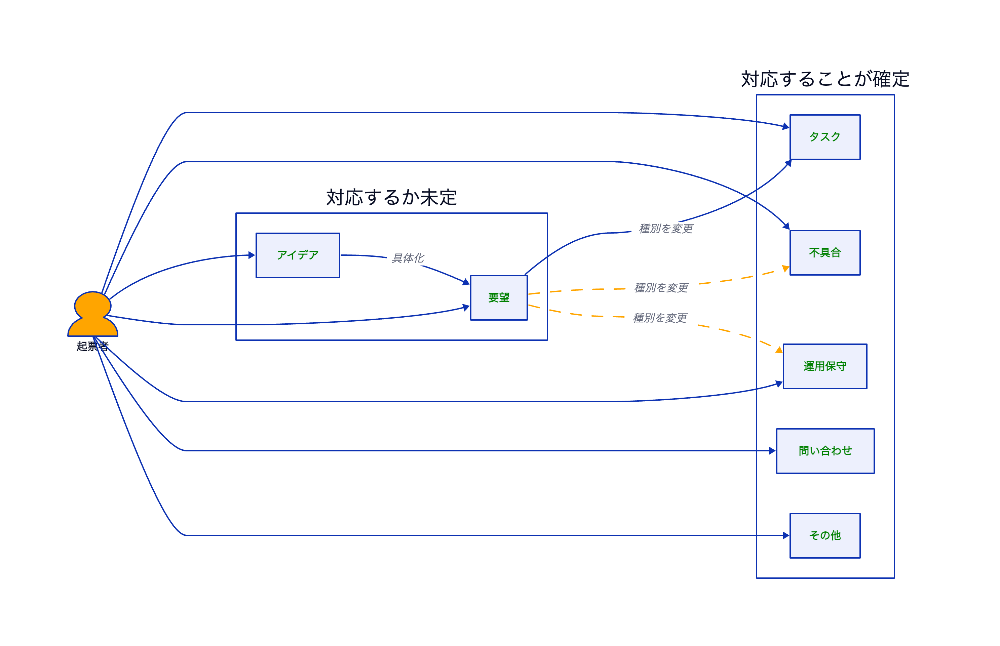

チケット管理の仕組み
=========================

概要
-------------------------

本ディレクトリでは、チケット管理の考え方を読みやすさ優先で分割して整理しています。
このページは入口として、全体像と各資料への導線をまとめます。

この運用は、AIがなくても進められるように設計しています。
必要に応じてAIや補助ツールを使うと、整理や確認をより効率化できます。

本資料では「チケット」を、アイデア・要望・タスク・不具合といった管理対象の総称として使用します。

読み進め方
-------------------------

1. まず、このページでチケット種別の全体像を掴みます。
2. 次に、新機能開発と不具合対応の基本線を確認します。
3. そのあと、[種別ごとのステータス遷移](#チケット種別ごとのステータス遷移)から必要なワークフローへ進みます。
4. 詳細が必要な場合は、以下の資料を参照します。
    - [[チケット管理の流れ]]
    - [[成果物ごとの役割]]
    - [[判断に迷ったときのFAQと実例]]
    - [[ワークフロー]]

基本方針
-------------------------

- 思いついた内容は、粗い段階でもまず記録します。
- 新機能は`アイデア → 要望 → タスク`の順に具体化します。
- 不具合は原則としてそのまま管理し、調査結果に応じてクローズまたは改善タスク化を判断します。
- 実装着手時には、必要に応じて作業プランとチェックリストを作成します。
- 作業前に設計レビューを行い、手戻りと認識ズレを減らします。

重要な考え方の全体像
-------------------------

この運用で重要なのは、チケットをいきなり完成形にせず、段階的に具体化していくことです。
あわせて、不具合は改善要望と混同せず、まず瑕疵として扱う点も重要です。

### まず押さえること: チケット種別の全体マップ

チケットは、いきなり同じ流れで処理するのではありません。
まず「どの種別で扱うか」を決め、そのあとで種別ごとの流れに沿って処理します。

- 対応するか未定のもの: アイデア、要望
- 対応することが確定しているもの: タスク、不具合、運用保守、問い合わせ、その他
- アイデアは要望の前段として扱い、独立したワークフローは持ちません
- アイデアや要望として受けたものでも、整理後にタスクや不具合へ変更する場合がある


<!-- source: type_map.d2 -->

まずはチケット種別の分類が入口になります。
この全体マップを先に理解すると、後続の処理フローを読みやすくできます。

### 段階的な具体化と種別ごとの処理

#### 新機能開発の基本線

```text
アイデア → 要望 → タスク
```

新機能や改善案は、まずアイデアとして記録し、要望として整理したうえで、必要な情報が揃った段階で着手可能なタスクに昇格します。

#### 不具合対応の基本線

```text
不具合 → 調査 → 判断
  ├ 真の不具合: 不具合のまま対応 (瑕疵として高優先)
  ├ 仕様誤解: クローズ (説明・ドキュメント追加)
  └ UI/UX問題: タスクに変更 (改善として対応)
```

不具合は瑕疵に該当する可能性があるため、種別を変えずに管理します。
ただし、調査の結果、UI/UXの改善課題と判明した場合などはタスクに変更します。

### 処理フローの要点

- 新機能系は`アイデア → 要望 → タスク`の順に具体化します。
- 不具合は、調査結果に応じてそのまま対応、クローズ、タスク化に分岐します。
- 作業着手後は、必要に応じて作業プランとチェックリストで設計レビューを行います。

詳細なフロー図や具体例は、[[チケット管理の流れ]]を参照してください。

チケット種別ごとのステータス遷移
-------------------------

各チケット種別により、ステータスの遷移ルールが異なります。
詳細は以下のドキュメントを参照してください。


<!-- source: status_overview.drawio -->

- [[ワークフロー]]: 全ステータス一覧と種別ごとの導線
- [[タスク]]: 対応確定済みチケットのワークフロー
- [[要望]]: 対応検討中チケットのワークフロー
- [[不具合]]: 不具合報告チケットのワークフロー
- [[問い合わせ]]: 問い合わせチケットのワークフロー
- [[運用保守]]: 運用保守対応チケットのワークフロー
- [[その他]]: 上記以外のチケットのワークフロー

補足: 成果物の位置づけ
-------------------------

ここから先は、チケットの種別や流れを理解したあとに参照する補足情報です。
詳細な考え方は、[[成果物ごとの役割]]を参照してください。

| 種別           | 主な目的                   | 参照先                           |
| -------------- | -------------------------- | -------------------------------- |
| アイデア       | ひらめきや仮説を残す       | [[成果物ごとの役割]] |
| 要望           | 実現したい内容を明確にする | [[成果物ごとの役割]] |
| 不具合         | 瑕疵や異常を記録する       | [[成果物ごとの役割]] |
| タスク         | 着手可能な作業に落とし込む | [[成果物ごとの役割]] |
| 作業プラン     | 実装手順と判断を記録する   | [[成果物ごとの役割]] |
| チェックリスト | 品質基準を確認する         | [[成果物ごとの役割]] |

関連資料
-------------------------

- [[チケット管理の流れ]]
    - 新機能開発と不具合対応のフロー
    - 要件定義から完了報告までの流れ
    - アイデアから完了までの実例
- [[成果物ごとの役割]]
    - 各成果物の使いどころ
    - 設計レビューの観点
    - 作業プラン変更時の考え方
- [[判断に迷ったときのFAQと実例]]
    - よくある判断ポイント
    - プロジェクト規模別の使い分け
    - 実務での補足例
