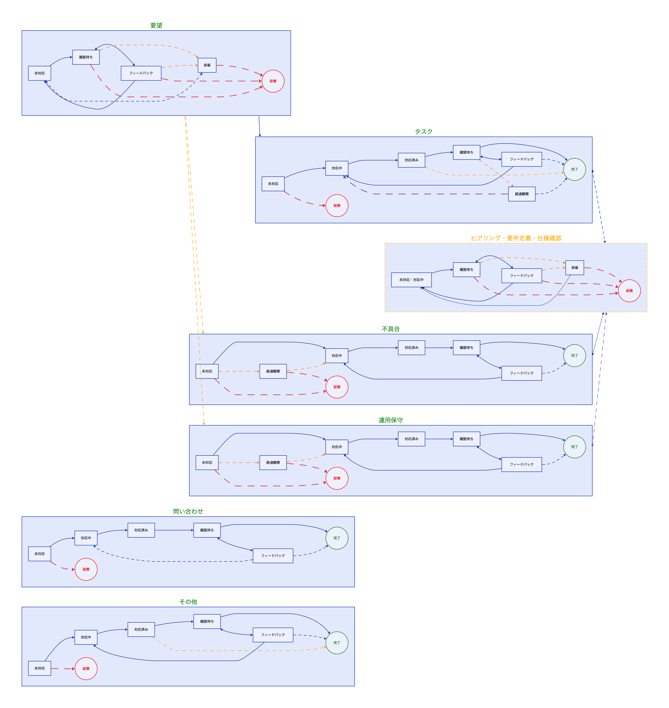

ワークフロー
=========================

概要
-------------------------

本ページでは、チケット運用で使用するワークフローをまとめます。
全ステータスの一覧と、種別ごとの詳細ページへの導線を確認できます。

全ステータス一覧
-------------------------

<!-- source: all_status.d2 -->

種別ごとのワークフロー
-------------------------

- [[タスク]]: 対応確定済みチケットのワークフロー
- [[要望]]: 対応検討中チケットのワークフロー
- [[不具合]]: 不具合報告チケットのワークフロー
- [[問い合わせ]]: 問い合わせチケットのワークフロー
- [[運用保守]]: 運用保守対応チケットのワークフロー
- [[その他]]: 上記以外のチケットのワークフロー

`アイデア`は要望の前段として扱うため、独立したワークフローページは設けていません。

補足
-------------------------

- 全体像の図は[[チケット管理の仕組み]]から参照できます。
- 仕様確認時の遷移は、各種別ページ内の補足図もあわせて確認してください。
