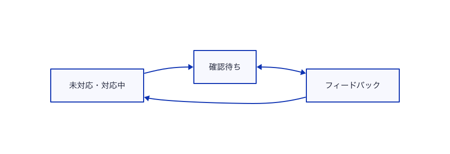

不具合
======================

不具合に関するチケットです。
システムの不具合だけでなく、見た目の表示崩れなどもこの種別を設定します。

不具合チケットのワークフロー
-------------------------

不具合チケットのワークフローは以下のとおりです。

### 情報が不足している・不明点があった場合のワークフロー

以下のようにステータス(や担当者)を切り替え、チケットがどのような状態になっているかわかるようにしておきましょう

図の説明は[確認用ワークフローの説明](confirm_status.md)を参照してください。

補足事項
-------------------------

「経過観察」ステータスは、環境依存などによりチケットに記載された事象が再現せず、
しばらく様子見を行う場合に設定するステータスです。

「経過観察」は全トラッカーで共通のステータス名です。
意味はトラッカーごとに異なるため、各ページの補足事項を確認してください。
これはステータスの増えすぎを防ぐための粒度設計であり、
現場の裁量で追加しても構いません。
