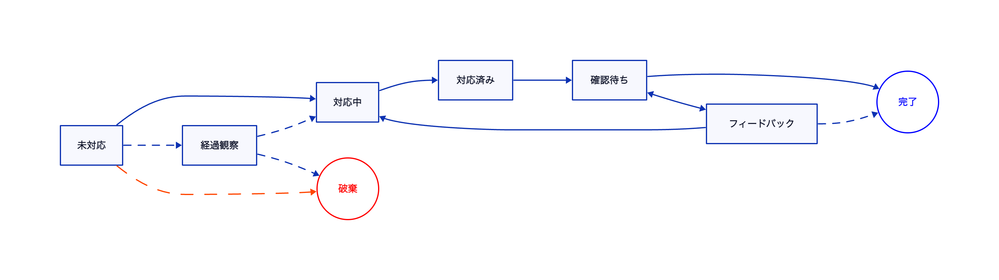

運用保守
========================

運用保守作業に関するチケットです。
依存パッケージの更新やセキュリティアップデート、技術的負債の解消、
ドキュメントのメンテナンスといった内容はこの種別を設定します。

運用保守チケットのワークフロー
-------------------------

運用保守チケットのワークフローは以下のとおりです。

補足事項
-------------------------

「経過観察」ステータスは、依存パッケージのアップデートがあったが場合に、
すぐに適用する必要があるかどうかわからない場合に場合に設定するステータスです。
