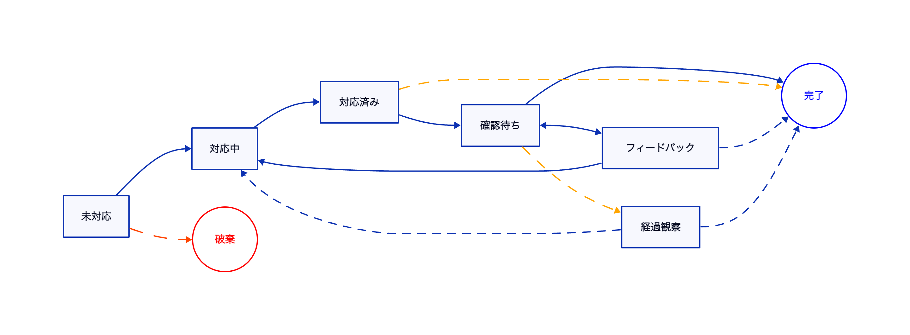
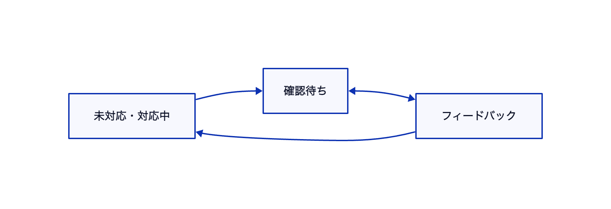

タスク
=============================

対応することが確定したチケットです。
主に機能追加や機能改善はこの種別を設定します。

タスクチケットのワークフロー
-------------------------

タスクチケットのワークフローは以下のとおりです。

### 情報が不足している・不明点があった場合のワークフロー

以下のようにステータス(や担当者)を切り替え、チケットがどのような状態になっているかわかるようにしておきましょう

補足事項
-------------------------

「経過観察」ステータスは実装完了後にABテストを実施する必要があるなど、
実装後にすぐに結果がわからない場合に設定するステータスです。
